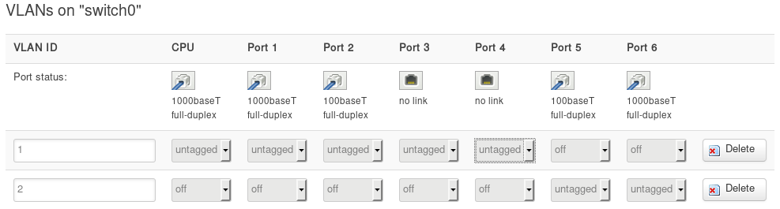
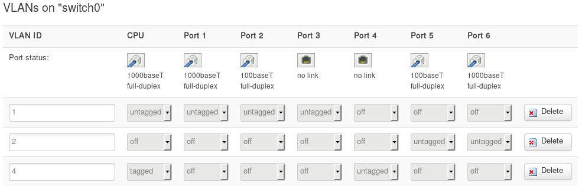

# Encrypting and Authenticating traffic over Powerline with OpenWRT and OpenVPN

---

*If you have not yet bought powerline adapters, I would strongly advise caution. In the end, the powerline network was way too slow to be of any use. Don't be spending big money if you're not confident they'll work well for 
you!*

## Before You Start

No powerline adapters are supported by OpenWRT at this time, so I consider them and the network link between them untrustworthy. For starters, because it is running non-free software I have no idea what it is truly doing, 
malicious or otherwise, and even if I trust the manufacturer, there could be various security issues with the software and it's encryption implementation - especially since it never gets updated. I treat the powerline network and 
devices as I would a public wifi, as other people with powerline adapters could potentially hook into mine through an outside power socket, or just by being my neighbour. So I need to take appropriate measures. First, the traffic 
that goes over the powerline should have an additional free-software implemented end-to-end encryption. Second, the powerline should be on distinc network/subnet with strict firewall rules, and only authenticated users can access 
my LAN and the internet from it. An openvpn server on my OpenWRT router, in addition to some firewall rules and custom VLANs will do the work.

For this I am using a TL-WR1043ND v3 router with OpenWRT 15.05.1. You will need a router with a manageable switch, which you can manage the VLANs of (look for 'Switch' option under 'Network' dropdown menu in Luci webui). One of 
the switch ethernet ports will be changed to use a different virtual lan, and you will have to plug one powerline adapter (from here on PLA) into this port. You will need space to install OpenVPN on your router's flash. I try to 
explain some common device setups that differ from mine, but you may have some difficulty following this guide if your device/configuration is different.

## Powerline VLAN & Network

### Switch VLAN

*This section is the most difficult to understand if you are not familiar with VLANs and OpenWRT, and the where you could most screw up. Re-read & think until you understand.*

Go to the Network->Switch page in the webui. You should have two default VLANs if your setup is like mine, VLAN1 for LAN ports, VLAN2 for WAN port which connects to a modem. My switch has two internal CPU ports, port 0 is labelled 
'CPU' which connects the LAN VLAN to the router, and 'Port 6' connects the WAN VLAN to the router. Each VLAN can have a specific setting for a specific port:

* off - this VLAN does not use this port.
* untagged - VLAN uses port, but it's traffic is not tagged with a VLAN ID, which is fine when only one VLAN uses this port.
* tagged - VLAN uses port, and is tagged with VLAN ID, so if multiple VLANs are using port their traffic can be kept separate.

Linux represents the switch as a physical interface, in my case two of them. The 'CPU' port from the switch's perspective, is eth1 from Linux, and 'Port 6' is 'eth0' (Other devices may be different). Virtual interfaces 
representing VLANs can be attached to these physical interfaces, for example eth1.2 representing VLAN 2 on eth1. The naming is only convention, and what really attaches a virtual interface to a VLAN is it's type as 'vlan' and id 
option set to the VLANID. In the Luci webui, because you cannot specify a VLANID when selecting a new/custom physical interface, using the convention ethXX.XX will automatically apply the appropriate attachement and VLANID.

By default untagged traffic will go through the base physical port, for me eth0 or eth1. However the PVID option can be set to make untagged traffic on a port go to a specific VLAN interface. The image below shows my default 
configuration. Each CPU port is used by only one VLAN, so each is used as 'untagged'. If you have a router where the LAN and WAN VLANs use the same internal port to communicate with the router, they 
should both be set to 'tagged' on that port. Perhaps alternatively one will be tagged and one untagged, with the untagged VLAN using the ethXX interface, and tagged using ethXX.XX, rather than both virtual ethXX.XX. 

In the above image, VLAN 1 is for the LAN, and it alone uses the CPU port and the 1-4 LAN ethernet ports physically available on the router. VLAN 2 alone uses Port 5 (the WAN ethernet port) and Port 6, which is an internal 
connection to router. No port is used by more than one VLAN, so they are all untagged. Below is taken from <https://wiki.openwrt.org/toh/tp-link/tl-wr1043nd#switch_ports_for_vlans> :

> The v2.x and v3.x get the lan and wan interface not via eth0.1/eth0.2 but via eth0 (wan) and eth1 (lan). The eth0 is in the same vlan as port 5 on the switch. Because of that, port 6 on the v2.x, v3.x routers is an additional 
> CPU port - used for wan traffic only.

In the case of v1 of my router, both LAN and WAN VLANs would share a single internal port, with their traffic being tagged and their network's both using VLAN interfaces.

Click the 'add' button down the bottom to add a third VLAN. The image below shows my new port settings:

I skipped VLAN 3 and am using ID 4 for powerline. Ethernet Port 4 is to be used by my powerline network, so I've turned it to 'off' on LAN's VLAN1, and set it to 'untagged' on VLAN 4. I've set the 'CPU' port to 'tagged' on VLAN4, 
and left it as 'untagged' on VLAN 1. This means I will not need to change my br-lan logical interface from including eth1 physical interface, as the untagged traffic from VLAN 1 will still go there. If you only have one internal 
port used by both the LAN and WAN VLANs, you will need to set your new VLAN to tagged on this. Click 'Save & Apply'.

... You could use WAN internal or CPU....???

### FireWall Zone

Go to Network->Firewall and add a new zone, call it something like 'powerline' and set it like this:

* Input to reject - The powerline network will not be able to send anything to it's router interface. We will add exceptions for DHCP and OpenVPN.
* Output to accept - Router will be allowed to output to the powerline network.
* Forward to reject - The router will not forward any traffic from powerline to other networks, such as LAN or WAN (these will be accessed through the vpn).

### Network Interface

Go to Network->Interfaces and click 'Add new interface...". This will be a logical interface, that uses one or more physical interfaces. Name it something like 'powerline', set protocol to 'Static address', and set it's physical 
interface to ethXX.YY where XX is the physical interface for the internal port you tagged on your VLAN (check the OpenWRT page for your router), and YY is the VLAN ID you used (for me it was 4). Click 'Submit'. Set your IPv4 
address and netmask, I used 192.168.3.1 and 255.255.255.0, and any other options you want. Click 'Setup DHCP server'. Click 'Firewall Settings' and then assign it to your powerline firewall zone. Then click 'Save & Apply'.

### Firewall Rules

Go to Network->Firewall and then click 'Traffic Rules'. We are going to add two with the following settings:

|		|							|
| ---	| :---:						| :---:
 **Name**	| *AllowDHCPfromPowerline*	| *AllowOpenVPNfromPowerline*
 **Protocol**	| 1							| 2
 **Source zone** |
 **Destination zone** |
 **Destination address** |
 **Destination port** |
 **Action** |
 
### Testing

While the VPN is not yet set up, the rest of your network (including internet) should not be accessible from powerline. You should however be assigned an IP address on it, because we allowed through DHCP. We also need to check the 
strict firewall is working, and you cannot access anything else.

## VPN

### Installing

Go to System->Software and click 'Update lists'. Install the openvpn-openssl, openvpn-easy-rsa and 
luci-app-openvpn packages.

### Config

---

https://wiki.openwrt.org/doc/networking/network.interfaces

https://wiki.openwrt.org/doc/uci/network/switch

ip-link man page.
